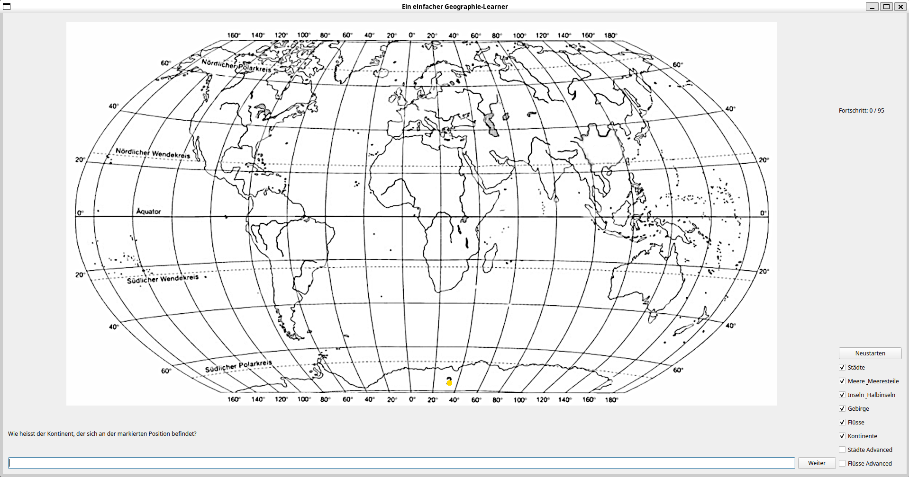

# Geography Learner App
Es gibt verschiedene Varianten, sich auf Toppografieprüfungen vorzubereiten und diese Applikation ist eine Option, dies zu tun.
Die Geography-Learner app wurde spezifisch kreiert, um die Grundzüge der Welttoppografie zu lernen und wiederholen.
[Direkt zu den Downloads](#Download)

## Aufgabentypen
Unterstützt werden die "typischen" Toppografiefragen, bei denen ein Punkt gegeben ist und der Name der Ortschaft, der Insel,
des Meeres, des Kontinentes, des Flusses oder des Gebirges eingegeben werden müssen.
Zudem gibt es die Möglichkeit mit vortgeschrittenen Fragen zu lernen, bei denen mehrere Informationen kombiniert werden müssen.
So kann beispielsweise gefragt werden, wohin der Mississippi fliesst, oder in welchem Land Lima liegt.

## Antworten
Die akzeptierten Antworten sind auf deutsch, und oft werden lokale Varianten ebenfalls akzeptiert.
Im Falle eines Namens mit Sonderzeichen wie "é", "à", "ã", etc. werden sowohl die Varianten ohne Akzent ("e", "a", "a"),
als auch die Varianten mit vorgesetzten Akzenten ("´e", "`a", "~a") akzeptiert,
da aufgrunde von limitationen des verwendeten Grafik-Frameworks die normale Schreibform solcher Sonderzeichen nicht akzeptiert wird.

## Download
Unterstützte Plattformen:
* [Windows](https://raw.githubusercontent.com/PhoenixPhantom/GeographyLearner/master/Installer/GeographyLearnerInstallerWin.exe)
* [MacOS (M* Prozessoren)](https://raw.githubusercontent.com/PhoenixPhantom/GeographyLearner/master/Installer/Macos/GeographyLearnerInstaller.app)
* [MacOS (legacy)](https://raw.githubusercontent.com/PhoenixPhantom/GeographyLearner/master/Installer/Macos/GeographyLearner.dmg)  
* 

Bearbeitungsprogramm

<dl>
  <dd>
	Für Windows und die neueren MacOS versionen kann der Editor über den normalen
	Link heruntergeladen warden und dann im Installer ausgewählt warden.
	Für ältere MacOS Versionen kann
	[dieser Link](https://raw.githubusercontent.com/PhoenixPhantom/GeographyLearner/master/Installer/Macos/GeographyLearnerEditor.dmg)
	verwendet warden.
	In allen Fallen ist ein Passwort nötig, welches ich bei Nachfrage angeben werde.
  </dd>
</dl>

Kann der GeographyLearner auch auf den Linux, IOS und/oder Android Plattformen gebraucht werden?

<dl>
  <dd>

  Der GeographyLearner ist __zurzeit leider nur für Windows und neue MacOS versionen__ direkt als Downloadlink erhältlich.
  
  Grundsätzlich ist die Antwort aber *ja*.
  Die Ressourcen sind auf dieser Seite vorhanden und können für diese Plattformen *lokal kompilliert* werden.

  

Lokal kompilieren

  <dl>
  <dd>
    
1. Lade das vollständige `GeographyLearner` Repository herunter 
2. Lade den [Qt Creator](https://www.qt.io/download) auf das zu verwendende Gerät herunter & installiere die Applikation (die Standardinstallation reicht aus)
3. (für Linux: Lade libgit2 herunter (`apt install libgit2-dev` auf Ubuntu))
4. Wähle eines der folgenden:
   * Grafische Installation
      1. Öffne die Qt Creator app
      2. Öffne ein existierendes Projekt, indem du die `CMakeLists.txt` datei aus dem Repository auswählst
      3. Konfiguriere das Projekt, indem du nur das `Release`-Target auswählst
      4. Im `Build`-Menu wähle `Build Project`
      5. Die ausführbare Datei befindet sich nun unter 'build/\[Compilername\]/GeographyLearner'
   * Installation über die Command Line (NICHT EMPFOHLEN)
      1. Öffne ein Terminal, das Zugang zur Qt installation und dem zur Installation passenden C++ Compiler hat
      2. Versichere dich, das `CMake` installiert ist
      3. Wechsle in den `GeographyLearner`-Ordner 
      4. Ist `ninja` installiert:
         1. Führe `cmake -DCMAKE_BUILD_TYPE=Release -S. -Bbuild -G Ninja` aus
         2. Führe `ninja -C build` aus
      5. Ansonsten:
         1. Führe `cmake -DCMAKE_BUILD_TYPE=Release -S. -Bbuild` aus
         2. Führe `cmake --build build` aus
      6. Die ausführbare Datei befindet sich nun unter 'build/GeographyLearner'

  </dd>
</dl>

  </dd>
</dl> 

Sind gewisse externe Programme vorausgesetzt?

<dl>
  <dd>
  
  Die Learner-Version des GeographyLearners __funtioniert komplett eigenständig__ und macht somit von keinen externen Applikationen Gebrauch.
  
  

Und für die Editor-Version?

  <dl>
  <dd>
    
  Für die Editor-Version des Geographylearners, ist jedoch das Vorhandensein einer externen Applikation nötig, um das Hochladen bearbeiteter Lernsets zu ermöglichen. : [Das command-line tool 'git'](https://git-scm.com/downloads)

  Allerdings ist eine __manuelle Anmeldung__ mit dem tool `git` notwendig.
  Auf MacOS:
	* drücke `command + space` und suche nach "Terminal"
  Auf Windows:
	* drücke die Windowstaste und suche nach "powershell"
  
  Dann:
	* Gib `git config --global user.name ???` ein und drücke Enter (??? == Dein Name)
	* Gib `git config --global user.email ???` ein und drücke Enter (??? == Deine mail oder "-")
	* Gib `git config --global github.user PhantomPhoenix` ein und drücke Enter
	* Gib `git config --global github.token ***`ein und drücke Enter (*** == Token-Passwort (wird von mir manuell Zugestellt))
    </dd>
</dl>
  

  </dd>
</dl>

## Geistiges Eigentum
Der GeographyLearner ist ein C++20 basiertes Programm und verwendet für Darstellungszwecke 
das Grafikframework Qt. Einige der verwendeten grafischen Elemente sind wurden als externe 
Dateien beschafft und sind [hier](Data/Attributions.md) explizit aufgelistet. 
Ausserdem wird die [nlohmann json](https://github.com/nlohmann/json?tab=readme-ov-file) 
Bibliothek für Speicherzwecke und die [libgit2](https://github.com/libgit2/libgit2?tab=readme-ov-file) 
Bibliothek für Interaktionen mit Git verwendet.
Da libgit2 manchmal schwierig zu verwenden ist,
habe ich mich entschieden es in einigen Fällen durch das Command-Line-Tool [`git`](https://git-scm.com/downloads) zu ersetzen.

## Verbesserungen
Sollte eine gebräuchliche Antwort nicht akzeptiert sein, oder ein anderer Fehler gefunden werden,
bin ich froh, wenn ein Fehlerreport in Github erstellt wird, sodass ich ihn korrigieren kann.
